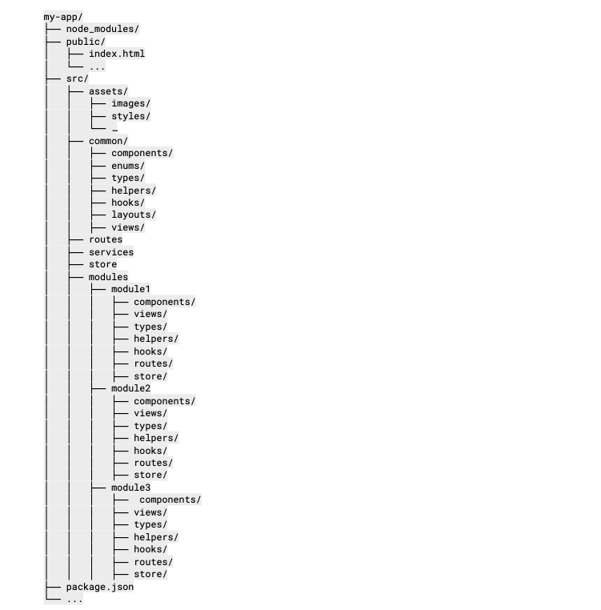

### What folder structure to use depends on the needs of the project?

Modular Architecture:
We use a modular pattern as architecture for our projects. In the case you have different types of users for example a customer and a seller. That see different things or you want to have feature flags or the application may scale in the future. The folders are found in modules and can be used as separate applications. Although you also have components in common. It is important that if we are developing something that use a component that is in one module we need to move that component to the folder /common.

#### Component-Based Architecture:

- **Common:** Components and things that are used for more than one module.
- **Components:** A directory to contain all the reusable components that are used across different views in your app. Examples might include buttons, input fields, dialogs, etc. Folders here are split for the different features and shared components.
- **Design (optional):** For projects using Tailwind CSS or other atomic CSS libraries, it could be beneficial to have a separate folder to store basic design components (empty, stylized components). You can then reuse and compose these components into more complex pieces in your components directory.
- **Views:** This directory should contain components that represent different pages of your application. In a routing setup, each route would be tied to a view component.
- **Helpers:** A folder to keep any utility or helper functions that are used across the application. This helps to avoid repetitive code and allows for cleaner components and views.
- **Types:** If you're using TypeScript, this is where you should put all your type definitions that are shared across different components and features.
- **Assets:** This directory should hold all the static files such as images, fonts, and stylesheets if needed.

