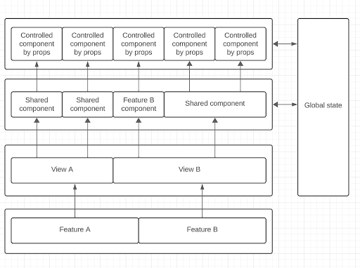
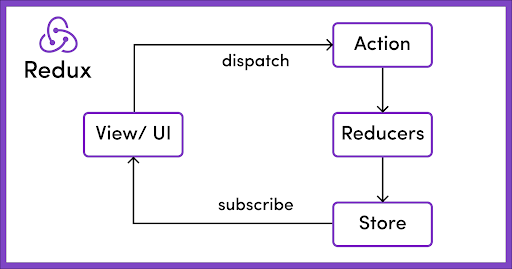

# State Management

**Technology Review**  
_Written by: Federico Castañares, Facundo Panizza_

### An example of application layers

Defining how we separate our application layers helps us maintain a clean architecture. The definition may vary depending on the solution we want to achieve, but here's an example:



In this example, we will have several features with their respective views. Each view can have shared or specific components for that feature. These components will control the application's state, either mutating it or simply reading it, using controlled components through props to render their content.

The state in this example can contain both data and UI state.

### Common State Management Concepts

Regardless of the state management library we choose **(Redux or Zustand)**, we find common patterns that help in our development.

### Global State

**When to use:** We can use global state management in any flow where we want to persist data even when components are unmounted, and when returning to the same state, it remains. Or when we have globally useful abstract information, for example, user information that can be used in multiple places, making it useful to access globally.

**Pros:**

- Significantly reduces prop drilling
- Separates state management logic from UI
- Provides data accessibility from other components

**Cons:**
- Must consider cleaning up states when necessary as they persist even when components are unmounted

### Section Components

We can refer to section components as those that correspond to a page layout or a section of it. From these components, we'll provide the structure and load the necessary data to call the controlled components by props.

**These components:**
- Load the required information
- Provide the section layout

### Controlled Components by Props

**What they are and why make them controlled by props**

These components receive their state and the function to change it through their props. This facilitates component reuse within our application; we just need to respect their interface. We could call them visual or design components.

**Pros:**
- They are easier components to maintain
- They allow for greater reuse
- They are a good way to implement branding

**Cons:**
- If we have several nested components of this type, it can generate a lot of prop drilling

### Redux

**Pros:**

- Centralized global state. With Redux, we can store both our data and our UI in a single library
- Debugging. With redux-devtools, we can see how our app is changing state, how, and when
- Scalable. We can add and remove reducers while maintaining the structure

**Cons:**

- Boilerplate. Considerable boilerplate is required for its implementation
- Learning curve. It has complexity for understanding at the beginning
- Verbosity. Redux can make your code more verbose, and for simple applications, the benefits might not outweigh the costs

#### Store Structure

One way to structure the store can be to respect the entities we have in our backend, having one reducer for each entity and adding to this a reducer per feature to handle the UI state of the same.

In this way, each reducer copy of an entity will be separate from each feature and can be reused.



### Zustand

**Pros:**

- Minimal boilerplate. Much simpler setup compared to Redux
- TypeScript friendly. Great type inference out of the box
- Small bundle size. Significantly smaller than Redux
- Flexible architecture. Supports both centralized and feature-based store organization

**Cons:**

- Less established ecosystem compared to Redux
- Fewer dev tools available out of the box
- May require additional effort for complex middleware scenarios

#### Feature-Based Store Organization

An alternative approach to store management, particularly well-suited for Zustand, is to organize stores by feature rather than maintaining a centralized store. This approach follows a more modular pattern:

```
- src
  - common
    - components
    - views
    - hooks
      - use-auth-store.ts
      - use-additional-store.ts
  - modules
    - wallets
      - components
      - views
      - hooks
        - use-wallets-store.ts
```

**Benefits of this approach:**
- Better code splitting: Stores are only loaded when their respective features are used
- Improved maintainability: Each feature manages its own state
- Reduced complexity: Easier to understand and modify individual feature states
- Better performance: Stores are created on-demand when features are accessed

### useContext

**Pros:**

- It is simpler to use than more complex libraries like Redux
- It does not require as much boilerplate code
- It is a native feature of React

**Cons:**

- It can limit you when you have a complex application
- It is easy to make mistakes that render the entire application or many parts that you do not want to render again
- It does not have any developer tools to view the current state of your application, such as Redux DevTools